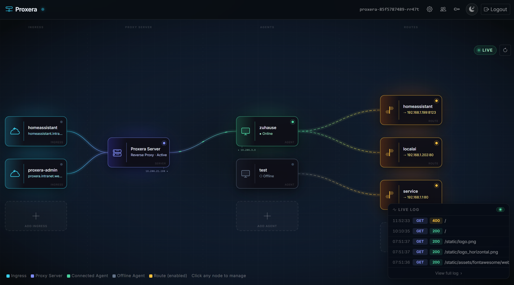

# Proxera

[](https://github.com/wenisch-tech/proxera/releases)
[](https://github.com/wenisch-tech/proxera/blob/main/LICENSE)
[](https://github.com/wenisch-tech/proxera/pkgs/container/proxera)



Proxera is a self-hosted reverse tunnel that lets HTTP services running in a private LAN be exposed to the internet — without opening any inbound firewall rules. It is similar in concept to Cloudflare Tunnel, but you don't have to route your traffic unencrypted through some 3rd party datacenters.

Please note: This application is still in an early alpha and under active development. Breaking changes to the API might be introduce anytime until a v1 Release.


## How It Works

1. **Proxera Server** runs in Kubernetes (this repository). It receives public HTTP requests and dispatches them through a persistent WebSocket tunnel to the registered agent.
2. **Proxera Agent** ([wenisch-tech/proxera-agent](https://github.com/wenisch-tech/proxera-agent)) runs in the LAN. It connects outbound to the server, awaits request frames, performs local HTTP calls, and sends the response back.

No inbound ports need to be opened in the LAN. All connectivity is agent-initiated.


## Features

- **WebSocket reverse tunnel** — persistent outbound connection from LAN client to cloud server
- **Multi-domain routing** — assign one or more public domains + optional path prefixes to any local service
- **Topology dashboard** — interactive live graph showing pods, connected clients, and active routes
- **Live request logs** — per-route scrolling access log streamed in real time
- **GitLab runner-style registration** — admin creates a named agent slot and generates a one-time token
- **Horizontal scaling** — optional Redis Pub/Sub message bus for multi-pod deployments; in-memory fallback for single-pod (no Redis required)
- **Admin UI + REST API** — Bootstrap 5 admin panel on port 8080 (same as proxy) with Swagger UI
- **Prometheus metrics** — at `/actuator/prometheus`
- **Helm chart** — production-ready Kubernetes deployment with separate ingress objects for proxy and admin

## Quick Start

### Prerequisites

Before deploying, ensure your DNS is configured:

| Domain | Target | Purpose |
|--------|--------|---------|
| `*.proxy.example.com` | Proxera proxy ingress IP / CNAME | Public hostname for all routed services and agent WebSocket tunnel |
| `admin.proxera.example.com` | Proxera admin ingress IP / CNAME | Admin UI and REST API access |

> Both records must resolve before the agent can connect and before routed domains become reachable.

---

### Step 1 — Deploy Proxera Server

**Kubernetes (Helm):**
```bash
helm repo add wenisch-tech https://charts.wenisch.tech
helm repo update
helm install proxera wenisch-tech/proxera \
  --set ingress.proxy.enabled=true \
  --set ingress.proxy.hosts[0].host=*.proxy.example.com \
  --set ingress.admin.enabled=true \
  --set ingress.admin.hosts[0].host=admin.proxera.example.com \
  -n proxera --create-namespace
```

**Docker (local / dev):**
```bash
docker run -d --name proxera -p 8080:8080 ghcr.io/wenisch-tech/proxera:latest
```

Proxera starts with an **embedded H2 database** by default — no external services required.

---

### Step 2 — Log in to the Admin UI

Open `https://admin.proxera.example.com/admin` (or `http://localhost:8080/admin` for Docker).

Default credentials: **admin / admin**

> **Important:** Create a new admin account and delete or change the default credentials immediately after first login.

---

### Step 3 — Create an Agent

An *agent* is a named slot that represents a Proxera Agent instance running in your LAN.

**Via the Admin UI:** Navigate to **Agents → New Agent**, enter a name (e.g. `home-lab`), and click **Create**.

**Via the API:**
```bash
curl -s -X POST http://localhost:8080/admin/api/agents \
  -H "X-API-KEY: your-api-key" \
  -H "Content-Type: application/json" \
  -d '{"name": "home-lab"}'
```

---

### Step 4 — Generate a Registration Token

Each agent authenticates with a one-time registration token. The token is shown **only once** — copy it immediately.

**Via the Admin UI:** Open the agent detail page and click **Generate Token**.

**Via the API:**
```bash
# Replace <agent-id> with the ID returned when creating the agent
curl -s -X POST http://localhost:8080/admin/api/agents/<agent-id>/token \
  -H "X-API-KEY: your-api-key"
```

The response contains a `token` field — save it for the next step.

---

### Step 5 — Install and Start the Agent

The Proxera Agent runs inside your LAN. Get it from [wenisch-tech/proxera-agent](https://github.com/wenisch-tech/proxera-agent).

**Helm (Kubernetes in LAN):**
```bash
helm repo add wenisch-tech https://charts.wenisch.tech
helm repo update
helm upgrade --install proxera-agent wenisch-tech/proxera-agent \
  --namespace proxera \
  --create-namespace \
  --set config.serverUrl="wss://tunnel.proxy.example.com/tunnel" \
  --set secret.apiKey="<registration-token>"
```

**Docker:**
```bash
docker run -d --name proxera-agent \
  -e PROXERA_SERVER_URL=wss://tunnel.proxy.example.com/tunnel \
  -e PROXERA_API_KEY=<registration-token> \
  ghcr.io/wenisch-tech/proxera-agent:latest
```

**Binary — Linux:**
```bash
# Download the latest release
curl -LO https://github.com/wenisch-tech/proxera-agent/releases/latest/download/proxera-agent-linux-amd64

# Verify checksum (recommended)
curl -LO https://github.com/wenisch-tech/proxera-agent/releases/latest/download/SHA256SUMS
sha256sum -c SHA256SUMS --ignore-missing

# Run
chmod +x proxera-agent-linux-amd64
./proxera-agent-linux-amd64 \
  --server-url wss://tunnel.proxy.example.com/tunnel \
  --api-key "<registration-token>"
```

**Binary — Windows (PowerShell):**
```powershell
# Download the latest release
Invoke-WebRequest -Uri "https://github.com/wenisch-tech/proxera-agent/releases/latest/download/proxera-agent-windows-amd64.exe" -OutFile "proxera-agent.exe"

# Run
.\proxera-agent.exe `
  --server-url wss://tunnel.proxy.example.com/tunnel `
  --api-key "<registration-token>"
```

Once started, the agent connects outbound to the server. Its status changes to **Connected** on the Agents page and in the Topology view. The registration token is consumed on first connect and cannot be reused.

---

### Step 6 — Add Routes

A *route* maps a public domain (and optional path prefix) to a local service reachable by the agent.

**Via the Admin UI:** Navigate to **Routes → New Route** and fill in:

| Field | Example | Description |
|-------|---------|-------------|
| **Agent** | `home-lab` | The agent that will handle requests for this route |
| **Domain** | `myapp.proxy.example.com` | Public hostname that Proxera matches incoming requests against |
| **Path prefix** | `/` | URL path prefix to match (use `/` to match all paths) |
| **Target URL** | `http://192.168.1.10:3000` | The local service URL the agent forwards requests to |

**Via the API:**
```bash
curl -s -X POST http://localhost:8080/admin/api/routes \
  -H "X-API-KEY: your-api-key" \
  -H "Content-Type: application/json" \
  -d '{
    "agentId": "<agent-id>",
    "domain": "myapp.proxy.example.com",
    "prefix": "/",
    "targetUrl": "http://192.168.1.10:3000"
  }'
```

You can add multiple routes per agent — each with a different domain or path prefix.

---

### Step 7 — Use It

With DNS already pointing `*.proxy.example.com` to the proxy ingress (see Prerequisites), `myapp.proxy.example.com` is immediately reachable. For local Docker testing, pass `Host: myapp.proxy.example.com` explicitly: `curl -H "Host: myapp.proxy.example.com" http://localhost:8080`.

Any HTTP request to `https://myapp.proxy.example.com` is now:

1. Received by the **Proxera Server**
2. Matched against your routes by domain + path prefix
3. Forwarded through the **WebSocket tunnel** to the **Proxera Agent** in your LAN
4. Proxied by the agent to `http://192.168.1.10:3000`
5. The response is streamed back to the original client

Monitor live traffic under **Routes → (route name) → Logs** or watch the **Topology** view for connected agents and in-flight requests.


## Configuration

Proxera is configured entirely through environment variables.

### Database

| Variable | Default | Description |
|---|---|---|
| `DB_HOST` | *(unset)* | PostgreSQL host. **When unset, embedded H2 is used.** |
| `DB_PORT` | `5432` | PostgreSQL port |
| `DB_NAME` | `proxera` | PostgreSQL database name |
| `DB_USER` | `proxera` | PostgreSQL username |
| `DB_PASSWORD` | *(empty)* | PostgreSQL password |

**Example — switch to PostgreSQL:**
```bash
docker run -d \
  -p 8080:8080 \
  -e DB_HOST=postgres.example.com \
  -e DB_NAME=proxera \
  -e DB_USER=proxera \
  -e DB_PASSWORD=secret \
  ghcr.io/wenisch-tech/proxera:latest
```

> The H2 web console is available at `http://localhost:8080/h2-console` when running with the embedded database.

### Redis (optional — multi-pod scaling)

| Variable | Default | Description |
|---|---|---|
| `REDIS_HOST` | *(unset)* | Redis host. **When unset, the in-memory message bus is used.** |
| `REDIS_PORT` | `6379` | Redis port |
| `REDIS_PASSWORD` | *(empty)* | Redis password |

When `REDIS_HOST` is set, Proxera uses Redis Pub/Sub to route tunnel frames across multiple pods, enabling horizontal scaling.

### Other

| Variable | Default | Description |
|---|---|---|
| `SERVER_PORT` | `8080` | Port for all traffic (admin UI + reverse proxy + tunnel WebSocket) |


| URL | Purpose |
|-----|-------|
| http://localhost:8080/admin | Admin UI |
| http://localhost:8080 | Proxy port (receives forwarded traffic) |

Default credentials: **admin / admin** — create new admin account immediately after first login.

## Architecture

See [docs/architecture.md](docs/architecture.md) for the full conceptual design including:

- System overview and component breakdown
- WebSocket tunnel protocol specification
- Redis Pub/Sub scaling model
- Routing algorithm
- Security model (registration token flow)
- Admin UI topology graph
- Data model
- Helm chart topology

## Development

### Prerequisites

- Java 17+
- Maven 3.8+

### Run from source

No database setup needed — H2 starts automatically.

```bash
git clone https://github.com/wenisch-tech/proxera.git
cd proxera
./mvnw spring-boot:run
```

Admin UI: http://localhost:8080/admin  
Proxy port: http://localhost:8080

### Run tests

```bash
./mvnw test
```

### Build JAR

```bash
./mvnw package -DskipTests
java -jar target/proxera.jar
```

## Documentation

Full documentation is available at [proxera.wenisch.tech](https://proxera.wenisch.tech) (generated from [docs/](docs/)).

## License

Licensed under [AGPL v3.0](LICENSE) by [Jean-Fabian Wenisch](https://github.com/jfwenisch) / [wenisch.tech](https://wenisch.tech)
